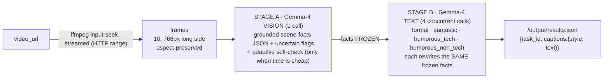

<div align="center">

# Four voices, one truth: a Gemma-4 video captioning agent

**Every clip, captioned in four distinct styles (formal, sarcastic, humorous-tech,
humorous-non-tech), all grounded in ONE verified pass over the video, so the jokes never
lie about what happened. Powered end-to-end by Google Gemma-4-31B.**

[](./LICENSE)
[](https://lablab.ai/)
[](https://ai.google.dev/gemma)

</div>

A caption that reads great can still be **wrong**, and the funnier it is, the more likely it
is lying. The leaderboard scores **accuracy AND tone**, so a sarcastic line that inverts what
happened, or a "tech" joke that invents packets and uptime, is a *wrong* caption that *sounds*
right. Most agents caption all four styles in one shot, so a single visual mistake poisons all
four. **This agent sees the video exactly once, freezes the facts, and only then writes four
styles off that frozen truth, so tone lives in the framing, never in a fabricated event.**

> *"One Gemma-4 vision pass turns the frames into a verified scene-fact record. Four parallel
> Gemma-4 text passes rewrite those same frozen facts into four voices, so a joke changes the
> tone but never invents an event. The grounding-discipline prompts keep even the tech-humor
> voice mapping its one engineering metaphor onto a real visible detail. And it is built for
> the latency gate: frames are streamed, not downloaded, so a 97MB 2-minute clip is captioned
> end-to-end inside the gate every time."*

The model isn't a swappable wrapper. **Remove Gemma and the agent does nothing**: every scene
fact and every caption is Gemma-4-31B.

---

## Receipts: re-run every one yourself

> Receipts, not vibes. Everything below is real and reproducible on a clean clone with one key.

| What | The receipt | Re-run it yourself |
|---|---|---|
| **The latency gate is beaten by streaming** | The acceptance test captions the real 97MB 2-minute UHD clip end-to-end (frames streamed, not downloaded) and **hard-asserts it finishes < 30s**. It used to download 97MB (20-40s just for that); it now streams in ~10s. | `python pipeline.py` |
| **Every style is grounded and mutually distinct** | Same run, 5 real clip URLs: asserts every requested style is a valid caption (non-empty, no leaked reasoning, sane length) and that the four are distinct strings. Exits 0 or fails loud. | `python pipeline.py` |
| **It runs headless in the grader's exact mode** | `docker run` reads `/input/tasks.json`, streams frames from each clip, writes `/output/results.json` in the exact schema. | `docker run --rm -v $PWD/in:/input -v $PWD/out:/output <image>` |
| **Accuracy is judged, not assumed** | A **cross-family** LLM-judge (Gemini / `gpt-oss:120b`, **never** Gemma judging Gemma) scores accuracy against the actual frames, plus style-match and style separation, per clip. | `python eval.py` |
| **A deliberately-wrong caption is caught** | The judge scores "A rocket launches into space" against a real clip at **accuracy < 0.30** (asserted), so the harness is calibrated, not a rubber stamp. | `python eval.py` |

### The commands a judge runs on a clean clone

```console
$ git clone <repo> && cd <repo>
$ pip install -r requirements.txt

# (1) the acceptance test: 5 real clips streamed end-to-end,
#     97MB clip hard-asserted < 30s, every style valid + distinct, exit 0
$ OLLAMA_API_KEY=... python pipeline.py

# (2) the cross-family eval: accuracy (sees the frames) + style + separation
$ OLLAMA_API_KEY=... python eval.py
```

---

## The inversion: the funniest caption is the easiest one to get wrong

The obvious read is *"humor is just a tone; slap it on at the end."* The opposite is true, and it's
the whole design problem. **Humor and sarcasm are exactly where accuracy dies:** to be funny, a
model reaches for a metaphor and, if you let it, states the metaphor as fact. "The bear runs its
fish-catching *algorithm* with zero *dropped packets*" reads great and is **false** (there is no
algorithm, there are no packets), so an accuracy judge kills it.

So this agent does the opposite of "style last." It **freezes the facts first**, forbids any style
from asserting a new event, and requires the tech-humor voice to map its single engineering
metaphor onto a REAL visible detail from the frozen facts (name the actual rally car, the actual
sunset, the actual kitten), never a literal object or person that isn't there. The framing is
unmistakably a joke, the literal scene stays true. Example of the target voice: *"Nature's annual
deployment: all leaf nodes updated to yellow simultaneously, no breaking changes reported."*
**The style tax is the enemy; the defense is the frozen facts plus the grounding-discipline prompt
rules, not a post-hoc filter.** The place the naive approach is weakest is the place this design is
strongest.

---

## How it works: see once, style four times



1. **Stage A, facts before voice.** ONE Gemma-4 **vision** call turns the frames into a grounded,
   *specific* scene-facts JSON (subjects with color/count, actions, setting, transcribed on-screen
   text, notable details, explicit `uncertain` flags). An adaptive self-check then tightens and
   hedges those facts, but only when the clip is still cheap (elapsed < 14s). On the big clip it is
   **skipped** to protect the latency gate. The facts are then **frozen**.
2. **Stage B, four voices, one truth.** Four **text-only** Gemma-4 calls rewrite the *same frozen
   facts* into the four styles, concurrently. Because they all share one verified fact base, a joke
   can change the *tone* but never the *events*.
3. **Built for the latency gate.** Long UHD clips are the trap: a clip that finishes too late is
   graded as a placeholder. So frames are **streamed** via ffmpeg input-seek and HTTP range
   requests (a 97MB 2-minute clip costs a few MB and streams in ~10s instead of a 20-40s full
   download), the self-check is skipped when time is tight, and clips run **concurrently** with a
   pre-seed so `results.json` is complete on disk before any model call and every clip lands well
   inside the gate. This is the measured engineering win.
4. **Robustness.** Gemma-4-31B leaks reasoning or drops the format on some calls, so every parsed
   output is wrapped in a strict `<json>` / `<caption>` delimiter and **regenerated** when the
   delimiter is absent, never patched after the fact. Every requested style is **always** populated
   with a grounded per-style fallback if a call fails (a missing style scores 0), and a global
   time-budget guard keeps `results.json` complete under the 10-minute cap. Partial-but-complete
   beats timed-out-and-empty, always.

---

## It reads the screen (specificity, not vague-but-safe)

The grounding pass is told to be **specific**: name concrete colors, counts, and breeds, and
**transcribe** any legible on-screen text (signs, scoreboards, jersey/lane numbers, timers,
watermarks) exactly as shown, or leave it in `uncertain` if it truly can't make it out. That is
why the acceptance set includes a sports clip with on-screen numbers: a caption that reads the
scoreboard is specific-and-true, where a generic one is only vague-but-safe.

---

## Gemma is load-bearing (the swap test)

Every scene fact and every caption is produced by **Gemma-4-31B**, served via Ollama Cloud
(`gemma4:31b-cloud`, `think:false` for clean low-latency output). The client is provider-agnostic
behind `call_vision` / `call_text` (`PROVIDER=google` runs the identical pipeline on the AI Studio
API), but the *model* is Gemma, deliberately: the "$3k Best Use of Gemma in Video Captioning"
challenge is the target, and removing Gemma removes the product. This is not a wrapper that could
run any VLM; the two-stage grounding and the style discipline are built around Gemma-4's multimodal
grounding.

---

## Run it

```bash
pip install -r requirements.txt

# local: key via env, nothing baked
OLLAMA_API_KEY=... PROVIDER=ollama python agent.py    # INPUT_DIR/OUTPUT_DIR override /input,/output

# container (how the grader runs it, headless)
docker run --rm -v /path/in:/input -v /path/out:/output <image>
#   reads  /input/tasks.json  = [{"task_id","video_url","styles":[...]}]
#   writes /output/results.json = [{"task_id","captions":{"<style>":"..."}}]
```

---

## Honest limitations (what we do NOT claim)

- **Style separation is an emergent property, not a guaranteed number.** It falls out of four
  genuinely distinct style prompts, and `eval.py` measures it (hand the judge the four captions
  unlabeled, it re-assigns them). We report whatever it comes out to on a given run to guide tuning;
  we do **not** claim a fixed separation score.
- **The local eval is a proxy, not the leaderboard judge.** `eval.py` uses a cross-family judge
  (Gemini / `gpt-oss:120b`) to *guide tuning*; the real Track-2 judge is different and unseen. We
  report the proxy honestly and treat the live leaderboard score as ground truth.
- **The sustainable accuracy judge (`gemma3:27b`) reads optimistically.** It's Gemma-*3* (a
  different generation from the Gemma-*4* captioner, so low self-bias), but a fully cross-family
  Gemini reading runs stricter. We anchor to the stricter number where we have it.
- **Accuracy on humor is the hard seam,** by design (see the inversion). It's the axis we tune
  hardest and the one we're most honest about.
- **We do not overfit to specific clips.** Prompts are generic; the eval set spans varied content
  (nature, sports, people, food, urban, night, static) so the agent generalizes to the hidden set.

---

## What's in the box

| File | Role |
|---|---|
| `agent.py` | entrypoint: `/input/tasks.json` to `/output/results.json`; clips captioned concurrently (pool of 2, env-overridable) with a pre-seed-and-upgrade write, per-task grounded fallback, global time budget |
| `pipeline.py` | the 2-stage pipeline: grounded vision facts + adaptive self-check, frozen, then 4 concurrent styled captions; delimiter-robust with a grounded per-style fallback |
| `prompts.py` | Stage-A grounding (specificity + on-screen-text transcription), the self-check, and the 4 style templates with the grounding-discipline block |
| `gemma.py` | Gemma-4 client (Ollama Cloud / AI Studio), retry+backoff |
| `frames.py` | video to 10 streamed frames (ffmpeg input-seek + HTTP range, concurrent), 768px long side, aspect-preserved; falls back to a single download only if a host lacks range support |
| `eval.py` | local cross-family LLM-judge harness (accuracy sees the frames + style + separation), self-calibrating |
| `Dockerfile` | linux/amd64, ffmpeg, < 1 GB |

---

## License

**MIT**, see [LICENSE](./LICENSE). Team **tripod** · AMD Developer Hackathon (ACT II) · Track 2.
