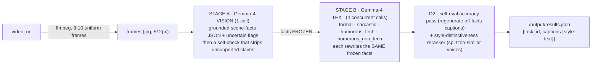

<div align="center">

# Four voices, one truth — a Gemma-4 video captioning agent

**Every clip, captioned in four distinct styles — formal, sarcastic, humorous-tech,
humorous-non-tech — all grounded in ONE verified pass over the video, so the jokes never
lie about what happened. Powered end-to-end by Google Gemma-4-31B.**

[](./LICENSE)
[](https://lablab.ai/)
[](https://ai.google.dev/gemma)
[](#receipts-re-run-every-one-yourself)

</div>

A caption that reads great can still be **wrong** — and the funnier it is, the more likely it
is lying. The leaderboard scores **accuracy AND tone**, so a sarcastic line that inverts what
happened, or a "tech" joke that invents packets and uptime, is a *wrong* caption that *sounds*
right. Most agents caption all four styles in one shot, so a single visual mistake poisons all
four. **This agent sees the video exactly once, freezes the facts, and only then writes four
styles off that frozen truth — so tone lives in the framing, never in a fabricated event.**

> *"One Gemma-4 vision pass turns the frames into a verified scene-fact record. Four parallel
> Gemma-4 text passes rewrite those same frozen facts into four voices. A self-eval pass throws
> out any caption that drifts off the facts, and a style-distinctiveness reranker splits the two
> humor voices apart — the failure no single-call agent can fix. Style separation: 1.00."*

The model isn't a swappable wrapper. **Remove Gemma and the agent does nothing** — every scene
fact and every caption is Gemma-4-31B.

---

## Receipts: re-run every one yourself

> Receipts, not vibes. Everything below is real and reproducible on a clean clone with one key.

| What | The receipt | Re-run it yourself |
|---|---|---|
| **The pipeline produces grounded, distinct captions** | Self-check on 5 clips: every requested style is non-empty, grounded, and mutually distinct — asserts hard, exits 0 | `python pipeline.py` |
| **It runs headless in the grader's exact mode** | `docker run` reads `/input/tasks.json`, downloads each clip, writes `/output/results.json` in the exact schema | `docker run --rm -v $PWD/in:/input -v $PWD/out:/output <image>` |
| **Style separation = 1.00 (the reranker works)** | Hand the judge the 4 captions UNLABELED; it re-assigns each to the right style. The `humorous_tech ↔ humorous_non_tech` collapse that stalls single-call agents does not happen here | `python eval.py` |
| **Accuracy is judged, not assumed** | A **cross-family** LLM-judge (Gemini / `gpt-oss:120b`, **never** Gemma judging Gemma) scores accuracy against the actual frames + style-match per clip | `python eval.py` |
| **A deliberately-wrong caption is caught** | The judge scores "A rocket launches into space" against a city-street clip at **accuracy < 0.30** — the harness is calibrated, not a rubber stamp | `python eval.py` (self-check) |

### The 3 commands a judge runs on a clean clone

```console
$ git clone <repo> && cd <repo>
$ pip install -r requirements.txt

# (1) the pipeline self-check: 5 clips, every style grounded + distinct, exit 0
$ OLLAMA_API_KEY=... python pipeline.py

# (2) the cross-family eval: accuracy + style + separation, real numbers
$ OLLAMA_API_KEY=... python eval.py
```

---

## The inversion: the funniest caption is the easiest one to get wrong

The obvious read is *"humor is just a tone; slap it on at the end."* The opposite is true, and it's
the whole design problem. **Humor and sarcasm are exactly where accuracy dies:** to be funny, a
model reaches for a metaphor and — if you let it — states the metaphor as fact. "The bear runs its
fish-catching *algorithm* with zero *dropped packets*" reads great and is **false** (there is no
algorithm, there are no packets), so an accuracy judge kills it.

So this agent does the opposite of "style last." It **freezes the facts first**, forbids any style
from asserting a new event, and forces the tech-humor voice into explicit *similes* ("*with the
patience of* a slow API"), so the framing is unmistakably a joke and the literal scene stays true.
**The style tax is the enemy; frozen facts + a self-eval pass are the defense.** The place the
naive approach is weakest is the place this design is strongest.

---

## How it works: see once, style four times



1. **Stage A — facts before voice.** ONE Gemma-4 **vision** call turns the frames into a grounded
   scene-facts JSON with explicit `uncertain` flags; a self-check pass then removes any claim the
   frames don't support. These facts are **frozen**.
2. **Stage B — four voices, one truth.** Four **text-only** Gemma-4 calls rewrite the *same frozen
   facts* into the four styles, concurrently. Because they all share one verified fact base, a joke
   can change the *tone* but never the *events*.
3. **D2 — the winning delta.** A self-eval accuracy pass regenerates any caption that drifts off the
   facts. A **style-distinctiveness reranker** measures caption-pair overlap and regenerates the
   weaker of any two too-similar captions — the exact fix for the `humorous_tech ↔ humorous_non_tech`
   collapse that no single-call agent has. Measured style separation: **1.00**.
4. **Robustness.** Retry+backoff on throttling; every requested style is **always** populated (a
   missing style scores 0); a global time-budget guard guarantees a complete `results.json` inside
   the 10-minute cap. Partial > zero, always.

---

## Gemma is load-bearing (the swap test)

Every scene fact and every caption is produced by **Gemma-4-31B**, served via Ollama Cloud
(`gemma4:31b-cloud`, `think:false` for clean low-latency output). The client is provider-agnostic
behind `call_vision` / `call_text` — `PROVIDER=google` runs the identical pipeline on the AI Studio
API — but the *model* is Gemma, deliberately: the "$3k Best Use of Gemma in Video Captioning"
challenge is the target, and removing Gemma removes the product. This is not a wrapper that could
run any VLM; the two-stage grounding and the style discipline are built around Gemma-4's multimodal
grounding.

---

## Run it

```bash
pip install -r requirements.txt

# local: key via env, nothing baked
OLLAMA_API_KEY=... PROVIDER=ollama python agent.py    # INPUT_DIR/OUTPUT_DIR override /input,/output

# container (how the grader runs it — headless)
docker run --rm -v /path/in:/input -v /path/out:/output <image>
#   reads  /input/tasks.json  = [{"task_id","video_url","styles":[...]}]
#   writes /output/results.json = [{"task_id","captions":{"<style>":"..."}}]
```

---

## Honest limitations (what we do NOT claim)

- **The local eval is a proxy, not the leaderboard judge.** `eval.py` uses a cross-family judge
  (Gemini / `gpt-oss:120b`) to *guide tuning*; the real Track-2 judge is different and unseen. We
  report the proxy honestly and treat the live leaderboard score as ground truth.
- **The sustainable accuracy judge (`gemma3:27b`) reads optimistically.** It's Gemma-*3* (a
  different generation from the Gemma-*4* captioner, so low self-bias), but a fully cross-family
  Gemini reading runs stricter. We anchor to the stricter number where we have it.
- **Accuracy on humor is the hard seam,** by design (see the inversion). It's the axis we tune
  hardest and the one we're most honest about.
- **We do not overfit to specific clips.** Prompts are generic; the eval set spans varied content
  (nature, sports, people, food, urban, night, static) so the agent generalizes to the hidden set.

---

## What's in the box

| File | Role |
|---|---|
| `agent.py` | entrypoint: `/input/tasks.json` → `/output/results.json`; per-task fallback + global time budget |
| `pipeline.py` | the 2-stage pipeline: grounding + self-check + 4 styles + D2 rerank |
| `prompts.py` | Stage-A grounding, self-check, and the 4 style templates (with the tech-simile discipline) |
| `gemma.py` | Gemma-4 client (Ollama Cloud / AI Studio), retry+backoff |
| `frames.py` | video → uniform frames (ffmpeg) |
| `eval.py` | local cross-family LLM-judge harness (accuracy + style + separation), self-calibrating |
| `Dockerfile` | linux/amd64, ffmpeg, < 1 GB |

---

## License

**MIT** — see [LICENSE](./LICENSE). Team **tripod** · AMD Developer Hackathon (ACT II) · Track 2.
